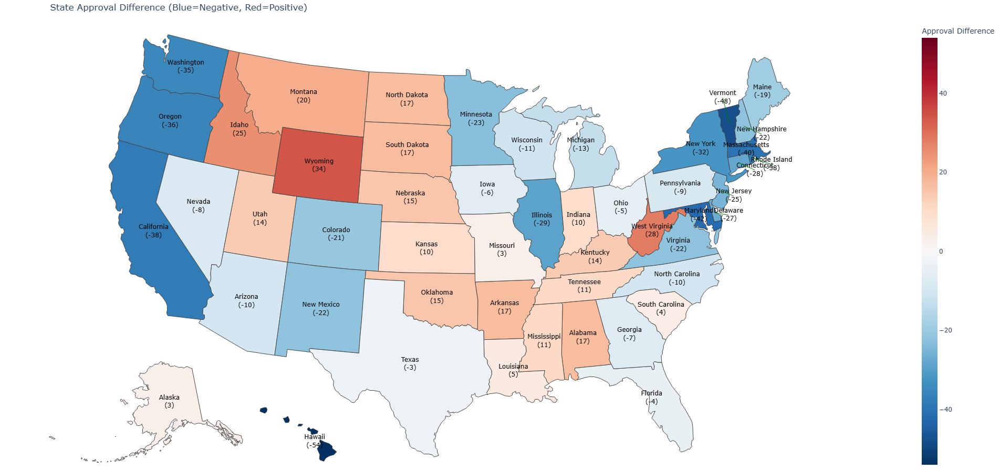
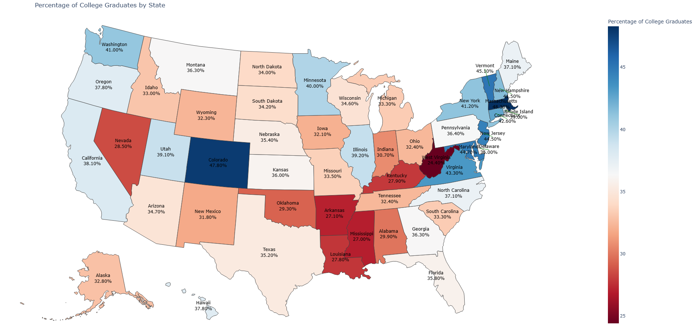
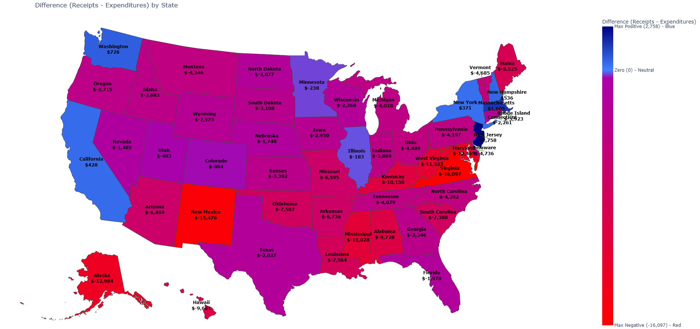

# Mapping Politics USA

## About

This project code and all of its documentation is located in the Python notebook file:


[MappingPoliticsUSA.ipynb](https://github.com/cesinco/MappingPoliticsUSA)

[MappingPoliticsUSA.ipynb](MappingPoliticsUSA.ipynb)


Just to give you a taste of what this project is about, I was interested in mapping how states in the USA reflect trends as related to such things as approval for the current president (as of Dec. 26, 2025), the percentage of college graduates (to measure which states are the least or most educated), and the net federal transfers (to measure dependency on federal funding). The Python notebook linked above produces an interactive map for each study, as well as static images linked below.

## Shifting support for trump

[Click here for interactive map](output/TrumpStateApprovalDifference.html)

## Educational attainment by state

[Click here for interactive map](output/PercentageOfCollegeGraduates2024.html)

## Federal Transfers dependency

[Click here for interactive map](output/Federal_Receipts_vs_Expenditures_by_State.html)

